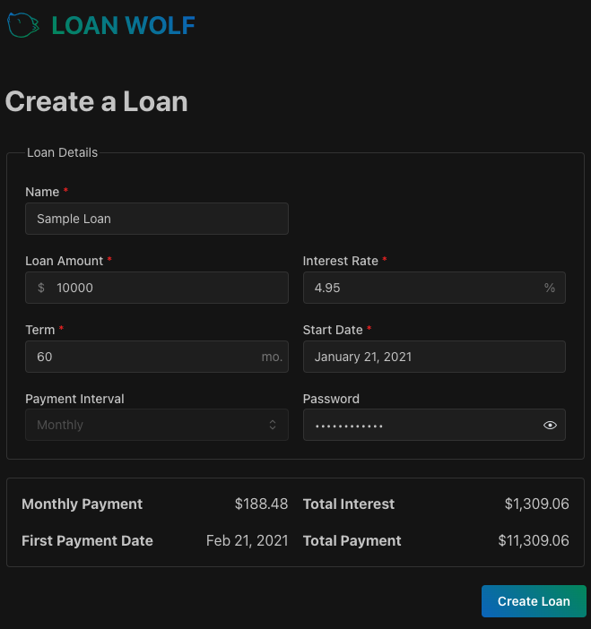
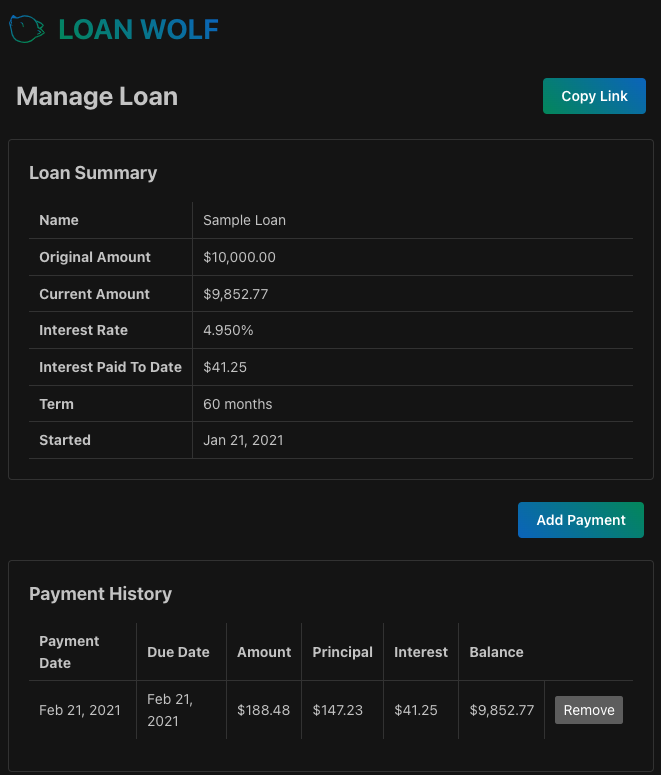

<div align="center">

<h1><a target="_blank" href="https://loan-wolf.r7.cx">LOAN WOLF</a></h1>

### Track loan payments like you're on the hunt!


https://loan-wolf.r7.cx

## About

Loan Wolf is a simple loan tracker that allows you to create loans and manage payments. It's built with [Remix](https://remix.run), [Prisma](https://prisma.io), and [Mantine](https://mantine.dev).

Create a shareable loan that only you can manage with basic password protection.

### Create a Loan



### Manage Payments



</div>


### Running Loan Wolf

To run the application yourself, I recommend using Docker:

```sh
docker run -d -v ~/.loan-wolf:/data/loan-wolf -p 3000:3000 ghcr.io/ryan-willis/loan-wolf:latest
```

Then visit [http://localhost:3000](http://localhost:3000) in your browser.

### Docker Compose

You can also use Docker Compose (if you've checked out the repo):

```sh
docker-compose up -d
```

Here's a minimal configuration for `docker-compose.yml`:

```yaml
services:
  loan-wolf-test:
    image: ghcr.io/ryan-willis/loan-wolf:latest
    ports:
      - 3000:3000
```

### Environment Variables

- `SESSION_SECRET` (required)
  - A secure string for signing session cookies.
- `PASSWORD_SECRET` (required)
  - A secure string for hashing passwords in the database (uses `argon2` under the hood).

## Local Development

Run the Vite dev server (full stack):

```sh
npm run dev
```
